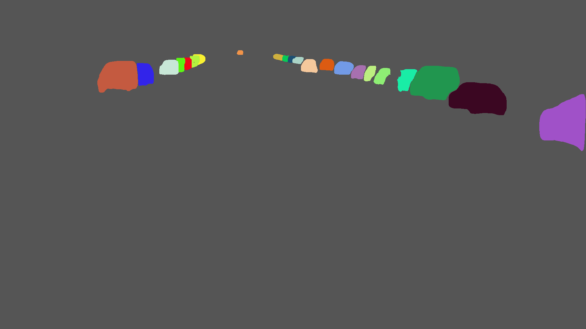

## Running the code
 - git clone https://github.com/matterport/Mask_RCNN.git
 - python3 setup.py install
 - download the maskrcnn pretrained weights and place it in the root of this repository [download weights](https://github.com/matterport/Mask_RCNN/releases/download/v2.0/mask_rcnn_coco.h5)
 - python calculate_accuracy.py, to get the output json or python calculate_accuracy_only_foreground.py, to get the output
 - pip install jupyterlab, and then run the required noteboooks

## Notes
 - Since majority of the instances can be of a small scale with respect to the full image, pixel wise accuracy that would take into account both the foreground and background will not give us usefull insights, it would simply measure how good the model is at detecting the majority class, here the majority class would be the background.
 - An alternative way to calculate the pixel wise accuracy would be including only the foreground pixels, any misclassification would be penalized and would add up in the final score. This would serve as a more robust method when the scales of object instances are small compared to the entire image.
 - The classes/ instances that could not be mapped to the coco dataset have been dropped from the output jsons, since there wouldn't be any detections.
 
 
 ## Visualization

  <a href="annotated_image.png" target="_blank"></a>
<a href="output_color_mask.png" target="_blank"></a>
 - left : annotated image (ground truth)
 - right : output from maskrcnn
 ```
 pixel wise accuracy for foreground
{
  "Car # 10": 0.42379958246347,
  "Car # 21": 0.58168693009119,
  "Car # 11": 0.86225895316804,
  "Car # 22": 0.96365059041115,
  "Car # 16": 0.94824016563147,
  "Car # 2": 0.92039667649424,
  "Car # 23": 0.95874703734546,
  "Car # 12": 0.65569620253165,
  "Car # 4": 0.736298649722,
  "Car # 17": 0.92109929078014,
  "Car # 20": 0.58519506502167,
  "Car # 24": 0.94820004090816,
  "Car # 18": 0.85123966942149,
  "Car # 13": 0.71920289855072,
  "Car # 9": 0.80865603644647,
  "Car # 7": 0.77855887521968,
  "Car # 19": 0.54895104895105,
  "Car # 1": 0.85949427480916,
  "Car # 3": 0.88144329896907,
  "car_group": 0.18532695374801,
  "Car # 15": 0.27439024390244,
  "Car # 6": 0.57142857142857,
  "Car # 5": 0.87012987012987,
  "Truck # 2": 0,
  "Car # 14": 0.35809018567639,
  "Car # 8": 0.76131687242798
}

``` 
 
 
```
 pixel wise accuracy for both background and foreground
{
  "Car # 10": 0.99979070216049,
  "Car # 21": 0.9988884066358,
  "Car # 11": 0.99983989197531,
  "Car # 22": 0.99926263503086,
  "Car # 16": 0.99985628858025,
  "Car # 2": 0.99981722608025,
  "Car # 23": 0.99916618441358,
  "Car # 12": 0.99973090277778,
  "Car # 4": 0.99980082947531,
  "Car # 17": 0.99978153935185,
  "Car # 20": 0.99930652006173,
  "Car # 24": 0.99899402006173,
  "Car # 18": 0.99982928240741,
  "Car # 13": 0.99978829089506,
  "Car # 9": 0.99969039351852,
  "Car # 7": 0.99969907407407,
  "Car # 19": 0.99942611882716,
  "Car # 1": 0.99893952546296,
  "Car # 3": 0.99975597993827,
  "car_group": 0.99876832561728,
  "Car # 15": 0.9991584683642,
  "Car # 6": 0.99951871141975,
  "Car # 5": 0.99969135802469,
  "Truck # 2": 0,
  "Car # 14": 0.99898533950617,
  "Car # 8": 0.99970052083333
}
```
